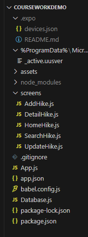
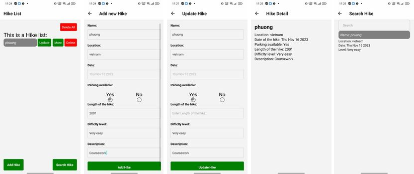

# CourseworkDemo

## Step 1: Set up the project

First, create a new React Native project using the React Native CLI:

```
npx react-native init CourseWorkDemo
cd CourseWorkDemo
```

The final folder structure will be like this:



The final Images of the application:



## Step 2: Install dependencies

Install the required dependencies for SQLite and navigation:

```
npm install expo-sqlite @react-navigation/native @react-navigation/stack
npx expo install @react-native-community/datetimepicker
npm i lodash.filter

```

## Step 3: Create the database

Create a file named **`Database.js`** in the root of your project and add the following code:

```jsx
import * as SQLite from 'expo-sqlite';

const database_name = 'CourseWork.db';
const database_version = '1.0';
const database_displayname = 'Coursework Database';
const database_size = 700000;

const db = SQLite.openDatabase(
  database_name,
  database_version,
  database_displayname,
  database_size
);
//DATA 1
const initDatabase = () => {
  db.transaction((tx) => {
    tx.executeSql(
      `CREATE TABLE IF NOT EXISTS hikes (
        id INTEGER PRIMARY KEY AUTOINCREMENT,
        name TEXT,
        location TEXT,
        date DATE,
        park TEXT,
        length INTEGER,
        level TEXT,
        des TEXT
      );`,
      [],
      () => console.log('Database and table created successfully.'),
      (error) => console.log('Error occurred while creating the table.', error)
    );
  });
};

const addHike = (name, location, date, park, length, level, des) => {
  return new Promise((resolve, reject) => {
    db.transaction((tx) => {
      tx.executeSql(
        'INSERT INTO hikes (name, location, date, park, length, level, des) VALUES (?, ?, ?, ?, ?, ? ,?)',
        [name, location, date, park, length, level, des],
        (_, { insertId }) => {
          resolve(insertId);
        },
        (_, error) => {
          reject(error);
        }
      );
    });
  });
};

const deleteAllHike = () => {
  db.transaction((tx) => {
    tx.executeSql(
      `DELETE FROM hikes`,
      [],
      () => console.log('Delete Successfully'),
      (error) => console.log('Error Deleteed.', error)
    );
  });
};

const getHikes = () => {
  return new Promise((resolve, reject) => {
    db.transaction((tx) => {
      tx.executeSql(
        'SELECT * FROM hikes',
        [],
        (_, { rows }) => {
          resolve(rows._array);
        },
        (_, error) => {
          reject(error);
        }
      );
    });
  });
};

const updateHike = (id, name, location, date, park, length, level, des) => {
  return new Promise((resolve, reject) => {
    db.transaction((tx) => {
      tx.executeSql(
        `UPDATE hikes SET name = ?, location = ?, date = ?, park = ?, length = ?, level = ?, des = ? WHERE id = ?`,
        [name, location, date, park, length, level, des, id],
        (_, { updateId }) => {
          resolve(updateId);
        },
        (_, error) => {
          reject(error);
        }
      );
    });
  });
};

const deleteHike = (id) => {
  return new Promise((resolve, reject) => {
    db.transaction((tx) => {
      tx.executeSql(
        'DELETE FROM hikes WHERE id = ?',
        [id],
        () => {
          resolve();
        },
        (_, error) => {
          reject(error);
        }
      );
    });
  });
};

const Database = {
  initDatabase,
  addHike,
  getHikes,
  updateHike,
  deleteHike,
  deleteAllHike,
};

export default Database;
```

## Step 4: Set up navigation

Create a new file named **`App.js`** in the root of your project and replace the default code with the following:

```jsx
import { NavigationContainer } from '@react-navigation/native';
import { createStackNavigator } from '@react-navigation/stack';
import React, { useEffect } from 'react';
import Database from './Database';
import DetailScreen from './screens/DetailHike';
import AddHike from './screens/AddHike';
import HomeHike from './screens/HomeHike';
import UpdateHike from './screens/UpdateHike';
import SearchHike from './screens/SearchHike';

const Stack = createStackNavigator();

const App = () => {
  useEffect(() => {
    Database.initDatabase();
  }, []);

  return (
    <NavigationContainer>
      <Stack.Navigator initialRouteName="Hike List">
        <Stack.Screen name="Hike List" component={HomeHike} />
        <Stack.Screen name="Add new Hike" component={AddHike} />
        <Stack.Screen name="Hike Detail" component={DetailScreen} />
        <Stack.Screen name="Update Hike" component={UpdateHike} />
        <Stack.Screen name="Search Hike" component={SearchHike} />
      </Stack.Navigator>
    </NavigationContainer>
  );
};

export default App;
```

## Step 5: Create screens

Create three new files inside the **`screens`** directory: **`HomeHike.js`**, **`UpdateHike.js`**, and **`DetailHike.js`**.

### HomeHike.js

In **`HomeHike.js`**, add the following code:

```jsx
import { useIsFocused } from '@react-navigation/native';
import React, { useEffect, useState } from 'react';
import {
  FlatList,
  StyleSheet,
  Text,
  TouchableOpacity,
  View,
  ScrollView,
} from 'react-native';
import Database from '../Database';

const HomeHike = ({ navigation }) => {
  const [hikes, setHikes] = useState([]);
  const isFocused = useIsFocused();

  useEffect(() => {
    const fetchData = async () => {
      try {
        const data = await Database.getHikes();
        setHikes(data);
      } catch (error) {
        console.log('Error fetching hikes', error);
      }
    };

    fetchData();
  }, [isFocused]);

  const handleDeleteHike = async (id) => {
    await Database.deleteHike(id);
    const data = await Database.getHikes();
    setHikes(data);
  };

  const handleDeleteHikeAll = async () => {
    Database.deleteAllHike();
    const data = await Database.getHikes();
    setHikes(data);
  };

  const renderHikeItem = ({ item }) => (
    <View style={styles.hikeItem}>
      <Text
        style={{
          fontSize: 15,
          fontStyle: 'italic',
          backgroundColor: 'grey',
          color: 'white',
          paddingRight: 8,
          paddingLeft: 8,
          paddingTop: 8,
          paddingBottom: 8,
          borderRadius: 10,
          width: 150,
        }}
      >
        {item.name}
      </Text>
      <TouchableOpacity
        style={styles.moreButton}
        onPress={() => navigation.navigate('Hike Detail', { hike: item })}
      >
        <Text style={styles.moreButtonText}>More</Text>
      </TouchableOpacity>
      <TouchableOpacity
        style={styles.updateButton}
        onPress={() => navigation.navigate('Update Hike', { hike: item })}
      >
        <Text style={styles.moreButtonText}>Update</Text>
      </TouchableOpacity>

      <TouchableOpacity
        style={styles.deleteButton}
        onPress={() => handleDeleteHike(item.id)}
      >
        <Text style={styles.deleteButtonText}>Delete</Text>
      </TouchableOpacity>
    </View>
  );

  return (
    <View style={styles.container}>
      <TouchableOpacity
        style={styles.deleteAllButton}
        onPress={() => handleDeleteHikeAll()}
      >
        <Text style={styles.deleteButtonText}>Delete All</Text>
      </TouchableOpacity>
      <Text style={{ fontSize: 25 }}>This is a Hike list:</Text>
      <ScrollView>
        <FlatList
          data={hikes}
          renderItem={renderHikeItem}
          keyExtractor={(item) => item.id.toString()}
        />
      </ScrollView>
      <View
        style={{
          flexDirection: 'row',
          justifyContent: 'space-between',
          alignItems: 'center',
        }}
      >
        <TouchableOpacity
          style={styles.addButton}
          onPress={() => navigation.navigate('Add new Hike')}
        >
          <Text style={styles.addButtonText}>Add Hike</Text>
        </TouchableOpacity>
        <TouchableOpacity
          style={styles.addButton}
          onPress={() => navigation.navigate('Search Hike')}
        >
          <Text style={styles.addButtonText}>Search Hike</Text>
        </TouchableOpacity>
      </View>
    </View>
  );
};

const styles = StyleSheet.create({
  container: {
    flex: 1,
    padding: 16,
  },

  hikeItem: {
    flexDirection: 'row',
    justifyContent: 'space-between',
    alignItems: 'center',
    marginBottom: 12,
  },
  deleteAllButton: {
    backgroundColor: 'red',
    padding: 8,
    borderRadius: 4,
    marginLeft: 253,
  },
  deleteButton: {
    backgroundColor: 'red',
    padding: 8,
    borderRadius: 4,
    position: 'absolute',
    right: 0,
  },
  moreButton: {
    backgroundColor: 'green',
    padding: 8,
    borderRadius: 4,
    position: 'absolute',
    right: 60,
  },
  updateButton: {
    backgroundColor: 'green',
    padding: 8,
    borderRadius: 4,
    position: 'absolute',
    right: 115,
  },
  deleteButtonText: {
    color: 'white',
  },
  moreButtonText: {
    color: 'white',
  },
  addButton: {
    backgroundColor: 'green',
    padding: 16,
    borderRadius: 4,
    alignItems: 'center',
  },
  addButtonText: {
    color: 'white',
    fontWeight: 'bold',
  },
});

export default HomeHike;
```

### UpdateHike.js

In **`UpdateHike.js`**, add the following code:

```jsx
import React, { useState } from 'react';
import {
  Alert,
  Pressable,
  StyleSheet,
  Text,
  TextInput,
  Platform,
  TouchableOpacity,
  View,
  ScrollView,
} from 'react-native';
import Database from '../Database';
import DateTimePicker from '@react-native-community/datetimepicker';

const UpdateHike = ({ navigation, route }) => {
  const [name, setName] = useState(route.params.hike.name);
  const [location, setLocation] = useState(route.params.hike.location);
  const [date, setDate] = useState(route.params.hike.date);
  const [park, setPark] = useState(route.params.hike.park);
  const [length, setLength] = useState(route.params.hike.length);
  const [level, setLevel] = useState(route.params.hike.level);
  const [des, setDes] = useState(route.params.hike.des);

  const [dob, setDOB] = useState(new Date());
  const [showPicker, setShowPicker] = useState(false);

  const toggleDatePicker = () => {
    setShowPicker(!showPicker);
  };
  const onChange = ({ type }, selectedDate) => {
    if (type == 'set') {
      const currentDate = selectedDate;
      setDOB(currentDate);

      if (Platform.OS === 'android') {
        toggleDatePicker();
        setDate(currentDate.toDateString());
      }
    } else {
      toggleDatePicker();
    }
  };
  const handleUpdateHike = async () => {
    if (!name || !location || !date || !park || !length || !level || !des) {
      Alert.alert('Error', 'All required fields must be field');
      return;
    } else {
      Alert.alert(
        'Confirmation Update: ',
        `New Hike will be add: \n
        Name: ${name} \n
        Location: ${location}\n
        Date: ${date} \n
        Parking available: ${park} \n
        Length of Hike: ${length} \n
        Difficulty level: ${level}`,
        [
          {
            text: 'Cancel',
            onPress: () => console.log('Cancel Pressed'),
            style: 'cancel',
          },
          {
            text: 'OK',
            onPress: async () => {
              await Database.updateHike(
                route.params.hike.id,
                name,
                location,
                date,
                park,
                length,
                level,
                des
              );
              navigation.goBack();
            },
          },
        ]
      );
    }
  };
  return (
    <View style={styles.container}>
      <ScrollView>
        <Text style={styles.label}>Name:</Text>
        <TextInput
          style={styles.input}
          value={name}
          onChangeText={setName}
          placeholder="Enter name"
        />

        <Text style={styles.label}>Location:</Text>
        <TextInput
          style={styles.input}
          value={location}
          onChangeText={setLocation}
          placeholder="Enter location"
        />
        <View>
          <Text style={styles.label}>Date:</Text>
          {showPicker && (
            <DateTimePicker
              mode="date"
              display="spinner"
              value={dob}
              onChange={onChange}
            />
          )}
          {!showPicker && (
            <Pressable onPress={toggleDatePicker}>
              <TextInput
                style={styles.input}
                value={date}
                onChangeText={setDate}
                placeholder="Enter Date"
                editable={false}
              />
            </Pressable>
          )}
        </View>
        <Text style={styles.label}>Parking available:</Text>
        <View style={styles.wrapper}>
          {['Yes', 'No'].map((parking) => (
            <View key={parking} style={styles.parkstyle}>
              <Text style={styles.parkstyles}>{parking}</Text>
              <TouchableOpacity
                style={styles.outter}
                value={park}
                onPress={() => setPark(parking)}
              >
                {park === parking && <View style={styles.inner} />}
              </TouchableOpacity>
            </View>
          ))}
        </View>
        <Text style={styles.label}>Length of the hike:</Text>
        <TextInput
          keyboardType="numeric"
          style={styles.input}
          value={length}
          onChangeText={setLength}
          placeholder="Enter Length of the hike"
        />

        <Text style={styles.label}>Difficlty level:</Text>
        <TextInput
          style={styles.input}
          value={level}
          onChangeText={setLevel}
          placeholder="Enter difficult level"
        />

        <Text style={styles.label}>Description:</Text>
        <TextInput
          style={styles.input}
          value={des}
          onChangeText={setDes}
          placeholder="Enter description"
          multiline
        />
        <TouchableOpacity style={styles.addButton} onPress={handleUpdateHike}>
          <Text style={styles.addButtonText}>Update Hike</Text>
        </TouchableOpacity>
      </ScrollView>
    </View>
  );
};

const styles = StyleSheet.create({
  container: {
    flex: 1,
    padding: 16,
  },
  label: {
    fontWeight: 'bold',
    marginBottom: 8,
  },
  input: {
    borderWidth: 1,
    borderColor: '#ccc',
    borderRadius: 4,
    marginBottom: 16,
    padding: 8,
  },
  addButton: {
    backgroundColor: 'green',
    padding: 16,
    borderRadius: 4,
    alignItems: 'center',
  },
  addButtonText: {
    color: 'white',
    fontWeight: 'bold',
  },
  outter: {
    width: 20,
    height: 20,
    borderWidth: 1,
    borderRadius: 15,
  },
  inner: {
    width: 12,
    height: 12,
    backgroundColor: 'gray',
    borderRadius: 10,
  },
  wrapper: {
    flexDirection: 'row',
    justifyContent: 'space-evenly',
    marginTop: 10,
  },
  parkstyle: {
    marginHorizontal: 15,
    alignItems: 'center',
  },
  parkstyles: {
    fontSize: 22,
    textTransform: 'capitalize',
  },
});

export default UpdateHike;
```

### DetailHike.js

In **`DetailHike.js`**, add the following code:

```jsx
import React from 'react';
import { ScrollView, StyleSheet, Text, View } from 'react-native';

const DetailScreen = ({ route }) => {
  const { hike } = route.params;

  return (
    <View style={styles.container}>
      <ScrollView>
        <Text style={styles.title}>{hike.name}</Text>
        <Text style={styles.description}>Location: {hike.location}</Text>
        <Text style={styles.description}>Date of the hike: {hike.date}</Text>
        <Text style={styles.description}>Parking available: {hike.park}</Text>
        <Text style={styles.description}>
          Length of the hike: {hike.length}
        </Text>
        <Text style={styles.description}>Difficlty level: {hike.level}</Text>
        <Text style={styles.description}>Description: {hike.des}</Text>
      </ScrollView>
    </View>
  );
};

const styles = StyleSheet.create({
  container: {
    flex: 1,
    padding: 16,
  },
  title: {
    fontWeight: 'bold',
    fontSize: 24,
    marginBottom: 8,
  },
  description: {
    fontSize: 16,
  },
});

export default DetailScreen;
```
